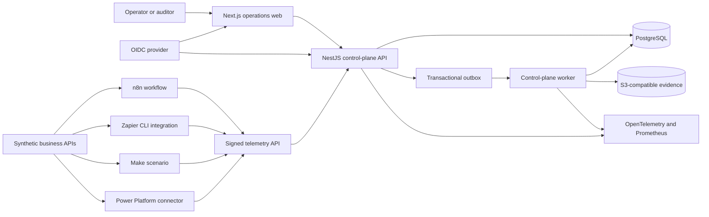

# Cross-Platform Automation Control Plane

## What we are building

This repository builds one authenticated operations application for teams that
use more than one automation platform. It governs n8n workflows, Zapier
integrations, Make scenarios, and Microsoft Power Platform solutions without
replacing those products or claiming capabilities their APIs do not provide.

The system has two complementary parts:

1. **The control plane** owns inventory, governance metadata, releases,
   telemetry, incidents, approvals, and audit evidence.
2. **The platform packages** contain native automation artifacts and a deep
   reference workflow for each vendor.

The result is inspectable portfolio evidence for both automation delivery and
production ownership: the repository shows what runs on each platform, how
changes are reviewed, how failures reach an operator, and where vendor-hosted
validation is still required.

## Why a control plane

Enterprises commonly accumulate automations across teams and tools. The
difficult questions are no longer limited to whether a workflow can move data:

- Who owns it and who may approve a release?
- Which systems and data classifications does it touch?
- Which environment and artifact version are running?
- Did an execution fail, retry, time out, or require human intervention?
- Are two alerts symptoms of the same incident?
- Is the deployed artifact different from the reviewed source?
- Can an auditor reconstruct the release and recovery decision without reading
  provider secrets?

Provider dashboards answer some of these questions for their own products. They
do not provide one portable operating model across all four. The control plane
standardizes only the metadata and telemetry that can be represented honestly.

## User experience

Operators access one web application through OpenID Connect. Server-side role
checks protect every action; hiding a button is never the authorization
boundary.

| Role               | Capabilities                                                   |
| ------------------ | -------------------------------------------------------------- |
| `PLATFORM_ADMIN`   | Manage platform registrations, policies, roles, and retention  |
| `AUTOMATION_OWNER` | Register automations, propose releases, maintain runbooks      |
| `RELEASE_APPROVER` | Approve or reject gated releases outside the proposer role     |
| `OPERATOR`         | Inspect executions, acknowledge incidents, record recovery     |
| `AUDITOR`          | Read immutable release, incident, approval, and audit evidence |
| `VIEWER`           | Read the catalog and operational summaries                     |

The application provides:

- a portfolio overview by platform, owner, risk, environment, and health;
- automation detail pages with dependencies, versions, controls, and runbooks;
- release comparison and approval screens;
- an execution timeline with normalized status and provider references;
- incident queues, assignment, evidence, recovery, and closure;
- policy exceptions with explicit expiry and approver;
- audit search and evidence export.

## System boundaries



### Control plane

The control plane is a TypeScript monorepo:

- **Next.js operations web** provides the single authenticated UI.
- **NestJS API** owns authorization, catalog, releases, approvals, telemetry,
  incidents, and audit.
- **NestJS worker** processes durable outbox work, incident correlation,
  retention, and evidence generation.
- **PostgreSQL** is the authority for control-plane state.
- **S3-compatible storage** holds generated evidence bundles, never vendor
  credentials.
- **Keycloak** provides local OIDC identities and role claims.
- **OpenTelemetry, Prometheus, and Grafana** expose technical and process
  health.

The API and worker are separate processes from one codebase. This keeps
transactions and domain rules cohesive while allowing ingestion and background
processing to scale independently.

### Platform adapters

Adapters do not scrape browser interfaces or require exported secrets. They use
the strongest source-controlled contract each vendor officially supports:

| Platform       | Git artifact                                     | Local evidence                                  | Vendor-hosted evidence                         |
| -------------- | ------------------------------------------------ | ----------------------------------------------- | ---------------------------------------------- |
| n8n            | Workflow JSON/package and TypeScript custom node | Import, execution, tests, failure recovery      | Optional target-instance promotion             |
| Zapier         | Platform CLI Node.js integration                 | Unit tests, request fixtures, schema validation | Zap creation, account connections, publish     |
| Make           | Scenario blueprint JSON                          | Schema, mapping, fixture, and contract checks   | Blueprint import and scenario execution        |
| Power Platform | YAML solution source and custom connector files  | Pack/unpack, OpenAPI, and policy checks         | Dataverse import, cloud flow and app execution |

Provider credentials are represented only by typed secret references. The
repository never stores connection exports, deploy keys, tokens, or
environment-specific identifiers.

## Shared contracts

### Automation manifest

Every automation has a versioned manifest containing:

- stable automation identifier and display name;
- platform and native artifact path;
- owner, support group, and business capability;
- risk tier and data classification;
- trigger type and declared dependencies;
- target environments and release strategy;
- expected execution SLA and alert threshold;
- runbook and recovery links;
- credential references by logical name;
- source checksum and release version.

The manifest is the portable catalog contract. It does not claim to be a
complete export of any provider's internal configuration.

### Execution event

Platform packages emit a versioned envelope:

```json
{
  "schema_version": "1.0",
  "event_id": "01J...",
  "automation_id": "claims-intake-n8n",
  "release_version": "1.3.0",
  "platform": "n8n",
  "environment": "demo",
  "execution_id": "provider-reference",
  "status": "FAILED",
  "occurred_at": "2026-09-20T08:00:00Z",
  "duration_ms": 1832,
  "error_code": "DEPENDENCY_TIMEOUT",
  "correlation_id": "synthetic-case-reference"
}
```

Events exclude access tokens, connection details, document content, customer
payloads, and raw provider logs. The ingestion API validates size, timestamp
skew, schema version, signature, replay identifier, and automation registration
before accepting an event.

### Release evidence

A release records:

- source commit and artifact checksum;
- manifest version and target environment;
- proposer and independent approver where policy requires it;
- automated validation results;
- provider deployment reference when one exists;
- declared configuration differences;
- rollback instructions and evidence expiry.

Checksums detect differences between reviewed artifacts and later registrations.
They do not prove that a vendor-hosted runtime has not changed unless that
provider exposes an independently retrievable artifact.

## Deep reference automations

The repository includes one substantial package per platform rather than shallow
hello-world examples.

### n8n: insurance claim intake and triage

A self-hosted n8n workflow accepts a synthetic claim, validates the request,
registers document metadata, checks policy status through a synthetic API,
routes high-risk cases to a human review wait state, retries bounded dependency
failures, and emits signed execution events. n8n can be run locally, so this
package receives full end-to-end and recovery testing.

### Zapier: partner onboarding integration

A Zapier Platform CLI integration exposes a polling trigger for new synthetic
partner applications and actions for document verification, case creation, and
status updates. Authentication, pagination, deduplication keys, HTTP middleware,
error mapping, and telemetry are tested locally. Creating and publishing a Zap
remains an account-scoped vendor action.

### Make: commerce return and refund orchestration

An importable Make blueprint receives synthetic return requests, retrieves the
order, routes by eligibility and value, creates warehouse work, requests
approval where required, and reconciles the refund result. Error routes report
normalized failures. Repository tests validate the blueprint, mapping contract,
fixtures, and API behavior; actual scenario execution requires a Make account.

### Power Platform: field inspection and approval

A source-controlled solution defines a custom connector to the synthetic
operations API, environment variables, connection references, role-aware field
inspection data, and an approval flow contract. The solution can be packed and
statically validated locally. Full canvas-app, Dataverse, and cloud flow proof
requires a licensed Power Platform developer environment and is recorded
separately rather than simulated.

## Reliability model

Telemetry delivery is at least once:

1. A platform package creates a stable event identifier.
2. The control plane accepts a valid event once and returns the prior result on
   replay.
3. The API stores the event and outbox intent in one PostgreSQL transaction.
4. The worker correlates failures into incidents and records derived health
   state.
5. A worker crash leaves durable outbox work available for lease-based recovery.

Duplicate provider callbacks and reordered events are expected. Unique event
identifiers, conditional state transitions, source timestamps, and release
versions prevent duplicates from rewriting history incorrectly.

No cross-platform exactly-once claim is made. Business-side actions must use
provider or synthetic API idempotency keys independently of control-plane
telemetry.

## Security model

- OIDC tokens are validated for signature, issuer, audience, expiry, and roles.
- Browser sessions use secure, HTTP-only cookies and CSRF protection.
- Machine ingestion uses a scoped client identity plus request signing.
- Platform credentials stay in each provider's connection store or an external
  secret manager.
- Manifests permit logical secret references but reject secret values.
- Approval separation is enforced server-side.
- Audit records are append-only through the application API.
- Logs and traces use synthetic identifiers and exclude automation payloads.
- Evidence downloads are authorized and time bounded.
- Local credentials are visibly synthetic and are not production configuration.

## Local and hosted verification

One local command will start:

- operations web;
- control-plane API and worker;
- PostgreSQL;
- Keycloak;
- S3-compatible storage;
- n8n;
- synthetic business APIs;
- OpenTelemetry Collector, Prometheus, and Grafana.

Local verification covers the control plane and n8n end to end. Zapier, Make,
and Power Platform packages receive all available offline tests and packaging
checks. Hosted proof is added only after the relevant user account and license
are available.

## Deployment direction

The reference deployment targets Kubernetes with non-root containers, health
probes, resource budgets, network policy, disruption budgets, horizontal
scaling, workload identities, managed PostgreSQL, and managed object storage.
Infrastructure definitions demonstrate a reviewable target; they are not
evidence of a live production deployment or regulatory certification.

## Deliberate non-goals

- replacing n8n, Zapier, Make, or Power Platform;
- storing provider credentials or customer payloads;
- scraping vendor user interfaces;
- claiming identical feature coverage across platforms;
- claiming hosted execution without account-backed evidence;
- autonomously approving high-risk releases;
- reconstructing a specific company's proprietary processes;
- presenting synthetic metrics as production outcomes.
